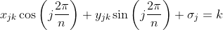

# QuasicrystalGifs


Generate animated gifs of quasicrystal patterns using sums of waves in the plane with python

If you like the quasicrystal scripts/notebooks, fork the repository and contribute or, give it a star!


## Usage

Assuming you have python in your path and all dependencies installed:
```sh
python quasicrystals.py -fn qc.gif
```

Here is the generated gif:


The above command will generate an animated gif called qc.gif with the
following default main settings:

| Name       | Short | Long         | Description                                     | Default   |
|------------|-------|--------------|-------------------------------------------------|-----------|
| Waves      | -wa   | --waves      | Number of waves in the plane                    | 5         |
| Stripes    | -st   | --stripes    | Number of stripes (or periods) per wave         | 37        |
| Iterations | -it   | --iterations | Number of frames in animation                   | 30        |
| Delay      | -de   | --delay      | Number of microseconds between animation frames | 8         |
| Resolution | -rs   | --resolution | Image size in pixels                            | 512       |
| Colormap   | -cm   | --colormap   | Colormap from matplotlib                        | PiYG      |
| Log-polar  | -lp   | --log_polar  | Use log-polar coordinates instead of Cartesian  | Cartesian |

And with the following default light source illumination settings:
| Name                  | Short | Long         | Description                                                                                          | Default |
|-----------------------|-------|--------------|------------------------------------------------------------------------------------------------------|---------|
| Blend mode            | -bm   | --blend_mode | Blend mode for light source - one of {soft, overlay, hsv}                                            | None    |
| Azimuth               | -az   | --azimuth    | Azimuth for light source measured clockwise from north in degrees                                    | 0       |
| Elevation             | -el   | --elevation  | Elevation for light source measured up from zero plane of the surface in degrees                     | 90      |
| Vertical exaggeration | -ve   | --vert_exag  | Ammount to exaggerate or de-emphasize elevation values by when calculating light source illumination | 1       |

All of the above arguments are optional.

Setting the waves option to 4 or 6 will produce an animation but it will not be
quasiperiodic.  No warning is given.

A colormap is a matrix of values that define the colors for graphics objects.
All the matplotlib colormaps are supported but I've not tested all of them.
Here is a list of the
[matplotlib colormaps](https://matplotlib.org/stable/tutorials/colors/colormaps.html).

Here is the
[matplotlib light source documentation](https://matplotlib.org/stable/api/_as_gen/matplotlib.colors.LightSource.html).
It's possible to de-emphasize and lose the rotational symmetry when adjusting
the light source settings.  The default azimuth and elevation settings specify
a light source directly above the plot.

The only required argument is -fn or --filename.

| Name       | Short | Long         | Description                                     |
|------------|-------|--------------|-------------------------------------------------|
| Filename   | -fn   | --filename   | Filename for animation                          |

The filename must use the gif file extension and should not use any sub-directories.

There is one more optional argument:

| Name  | Short | Long    | Description       | Default |
|-------|-------|---------|-------------------|---------|
| Quiet | -q    | --quiet | Turn off messages | False   |

Check the -h or --help options for further details like acceptable values for 
each command line option.


## Installation

Requires:
 * Recent version of [python 3](https://www.python.org/)
 * [numpy](https://numpy.org/) package
 * [matplotlib](https://matplotlib.org/) package

To install the two python packages:
```sh
pip install -r requirements.txt
```


[//]: # " * [Jupyter](https://jupyter.org/) "
[//]: # " One option is to clone the repository and open the notebook(s) in a local "
[//]: # " installation of Jupyter. "
[//]: # " ```sh "
[//]: # " git clone https://github.com/makeyourownmaker/QuasicrystalGifs "
[//]: # " cd QuasicrystalGifs "
[//]: # " jupyter notebook ... "
[//]: # " ``` "
[//]: # " Another option is to run the notebook(s) on NBViewer, MyBinder or Colab. "


After the above dependencies have been installed simply download and run the script:
```sh
wget https://raw.githubusercontent.com/makeyourownmaker/QuasicrystalGifs/master/quasicrystals.py
python quasicrystals.py -fn qc.gif
```

Alternatively, clone the repository and run the script:
```sh
git clone https://github.com/makeyourownmaker/QuasicrystalGifs
cd QuasicrystalGifs
python quasicrystals.py -fn qc.gif
```


[//]: # " ## Gallery "
[//]: # " Include command line args ... "


## Details

### What are quasicrystals?

A quasicrystal, or quasiperiodic crystal, is a solid material that is
intermediate between an orderly crystal and an amorphous glass.  They
resemble crystals because they are composed of repeating structural units
but they incorporate two or more unit cells into a quasiperiodic structure.
A unit cell is the smallest group of atoms which has the overall symmetry of
a crystal.
Quasicrystal patterns or ordered but not periodic and can continuously
fill all available space, but lack
[translational symmetry](https://en.wikipedia.org/wiki/Translational_symmetry).

Classic crystals can possess only two, three, four, and six-fold
[rotational symmetries](https://en.wikipedia.org/wiki/Rotational_symmetry);
as seen in their diffraction patterns.
The [diffraction patterns](https://en.wikipedia.org/wiki/Diffraction) of
quasicrystals show peaks with other symmetry orders.

Quasicrystals can be thought of as the 3 dimensional generalisation of a
[Penrose tiling](https://en.wikipedia.org/wiki/Penrose_tiling).


### How does this quasicrystal animation work?

Each frame of the animation is a summation of five or more waves at evenly-spaced
rotations.  That is, every point in each animation frame is colored according 
to the sum of sines and cosines depending on the x and y coordinates.  The
animation is determined by an evenly-spaced orientation angle between 0 and 
2 * pi.  The number of wave cycles in the animation is determined by
changing "stripes".  Larger numbers of stripes leads to finer structures.

This method is known as the dual method.  It is related to
[de Bruijn's multigrid method](https://www.mathpages.com/home/kmath621/kmath621.htm)
which can be used to create aperiodic tilings.
For an n-fold rotational symmetry the multigrid consists of n sets of parallel
lines with equidistant spacing, which are rotated against each other by
2 * pi / n radians.
The stripes parameter specifies the number of parallel lines in each set and
the waves parameter specifies the rotational symmetry.

The equation of the kth grid line in the jth set is:
<br/>

<br/>
where σ_j is an offset of the jth set of lines in the direction normal to the lines.

[//]: # " x_{jk} \cos{\left( j \frac{2 \pi}{n} \right)} + y_{jk} \sin{\left( j \frac{2 \pi}{n} \right)} + \sigma_j = k "

The [quasicrystals.py script](https://github.com/makeyourownmaker/QuasicrystalGifs/blob/main/quasicrystals.py)
uses this equation to calculate values at x and y coordinates.

Note: The
[generalised dual method](https://journals.aps.org/prb/pdf/10.1103/PhysRevB.32.5547)
(GDM) uses quasiperiodic grids, i.e. sets of parallel lines with spacings
from a
[Fibonacci](http://mill2.chem.ucl.ac.uk/ccp/web-mirrors/weber/~weber/qc.html#2.%20The%20Concept%20of%20Higher%20Dimensional%20Space)
[chain](http://mill2.chem.ucl.ac.uk/ccp/web-mirrors/weber/~weber/JAVA/jfibo/jfibo.html).
It is a method for generating quasicrystals
with any orientational symmetry (distinct angles between waves) and creates
a wider variety of space filling patterns than other methods.  The GDM is
**not** currently implemented in the quasicrystals.py script.


### Examples of quasicrystals

The first synthetic quasicrystal, a combination of aluminium and manganese, was 
reported by [Dan Shechtman](https://en.wikipedia.org/wiki/Dan_Shechtman) and 
colleagues.  Shechtman won the 
[2011 Nobel Prize in chemistry](https://www.nobelprize.org/prizes/chemistry/2011/press-release/) 
for this work.

[Icosahedrite](https://en.wikipedia.org/wiki/Icosahedrite) is the first
naturally occuring quasicrystal to be found.  It has the composition 
Al_63 Cu_24 Fe_13 and was discovered in a meteorite by 
[Luca Bindii](https://en.wikipedia.org/wiki/Luca_Bindi) and 
[Paul J. Steinhardt](https://en.wikipedia.org/wiki/Paul_Steinhardt).

A [holmium–magnesium–zinc (Ho–Mg–Zn) quasicrystal](https://en.wikipedia.org/wiki/Holmium%E2%80%93magnesium%E2%80%93zinc_quasicrystal)
has the shape of a regular dodecahedron, with 12 five-sided faces.

Hundreds of quasicrystals have been confirmed.  They are often found in
aluminium alloys.


## Limitations

These quasicrystal patterns don't have well defined lattice points, so
are not exactly quasicrystals.

The bottleneck in generating the animated gifs is the final step, saving them.
This involves a surprisingly large amount of data transfer.  See this
[stackoverflow answer for more details](https://stackoverflow.com/a/30704560/100129).
Note: the quasicrystals.py script uses
[PillowWriter](https://matplotlib.org/stable/api/_as_gen/matplotlib.animation.PillowWriter.html)
instead of
[ImageMagick](https://matplotlib.org/3.3.3/api/_as_gen/matplotlib.animation.ImageMagickWriter.html)
which saves a few seconds.

The -q or --quiet option will disable the Saving progress animation
and reduce runtime a little.

If you start having time or memory problems converting animations to gifs
then try using a black and white or greyscale colormap:
```sh
# Short options
python quasicrystals.py -q -fn qc.gif -cm binary

# Long options
python quasicrystals.py --quiet --filename qc.gif --colormap binary
```
Other black and white/greyscale colormaps include: binary, gist_yarg, gist_gray,
gray and Greys.

Reducing the resolution is also helpful:
```sh
# Short options
python quasicrystals.py -q -fn qc.gif -cm binary -rs 400

# Long options
python quasicrystals.py --quiet --filename qc.gif --colormap binary --resolution 400
```

Reducing the number of animation frames is also beneficial:
```sh
# Short options
python quasicrystals.py -q -fn qc.gif -cm binary -rs 400 -it 20

# Long options
python quasicrystals.py --quiet --filename qc.gif --colormap binary --resolution 400 --iterations 20
```


## Gallery

Log-polar coordinates with default settings (see table above):
```sh
# Short options
python quasicrystals.py -fn qc.gif -lp

# Long options
python quasicrystals.py --filename qc.gif --log_polar
```


```sh
python quasicrystals.py -wa 7 -st 128 -rs 800 -cm spectral -fn wa_7_st_128_rs_800_cm_spectral.gif

python quasicrystals.py --waves 7 --stripes 128 --resolution 800 --colormap spectral --filename wa_7_st_128_rs_800_cm_spectral.gif
```


```sh
python quasicrystals.py -wa 7 -st 128 -rs 800 -cm hsv -fn wa_7_st_128_rs_800_cm_hsv.gif

python quasicrystals.py --waves 7 --stripes 128 --resolution 800 --colormap hsv --filename wa_7_st_128_rs_800_cm_hsv.gif
```


```sh
python quasicrystals.py -fn qc_gray.gif -cm gray

python quasicrystals.py --filename qc_gray.gif --colormap gray
```


```sh
python quasicrystals.py -fn qc_ls_hsv_gray.gif -cm gray -bm hsv

python quasicrystals.py --filename qc_ls_hsv_gray.gif --colormap gray --blend_mode hsv
```


You can also browse through the gifs in the
[figures directory](https://github.com/makeyourownmaker/QuasicrystalGifs/tree/main/figures).


## Roadmap

 * quasicrystals.py:
   * Simplify handling of log-polar transformation
   * Allow specifying both width and height of images
   * Add generalised dual method
     * Instead of equidistant spacing between parallel lines, use quasiperiodic grids
     * i.e. sets of parallel lines with spacings similar to the Fibonacci sequence
     * See [Quasicrystals with arbitrary orientational symmetry](https://journals.aps.org/prb/pdf/10.1103/PhysRevB.32.5547)
   * Permit defining arbitrary orientational symmetry
     * Arbitrary angles between waves
     * Translational order will decrease
   * Include direction of rotation option
     * Currently defaults to anti-clockwise
   * Consider up, down and left, right scrolling
   * Consider zooming out animation

 * Expand README:
   * Add more examples to gallery
     * Particularly light source illumination examples
     * List command line arguments used for each animation
   * Describe log-polar transform instead of using Cartesian coordinates
     * Add figure
   * Describe rotational and translational symmetry of quasicrystals
     * Add figure
   * Add figure explaining dual method

 * Add Jupyter notebook(s):
   * Add links to run notebook(s) on NBViewer, MyBinder and Colab


## Alternatives

[Quasicrystals as sums of waves in the plane](http://mainisusuallyafunction.blogspot.com/2011/10/quasicrystals-as-sums-of-waves-in-plane.html)
is the earliest implementation I've been able to find.  In Haskell.

[Another early implementation](http://wealoneonearth.blogspot.com/search/label/quasicrystal).
This time in Java.  Requires post-processing with the convert tool from 
ImageMagick to produce animated gifs.  Code is readable but not vectorised.
[Additional code](https://github.com/michaelerule/quasicrystal).
[More recent work](https://crawlingrobotfortress.blogspot.com/search/label/quasicrystal).

[Quasiperiodic designs by Peter Stampfli](https://geometricolor.wordpress.com/tag/quasiperiodic-design/).
Including [quasiperiodic designs from superposition of waves from 2012](https://geometricolor.wordpress.com/2012/09/14/quasiperiodic-designs-from-superposition-of-waves/)
Also, [http://geometricolor.ch/](http://geometricolor.ch/)
which is a
[browser app for creating quasiperiodic wallpapers](https://geometricolor.wordpress.com/2019/04/04/waves-a-browser-app-for-creating-quasiperiodic-wallpapers/).
[https://github.com/PeterStampfli/images](https://github.com/PeterStampfli/images)

[Andrew Horchler's Matlab implementation](https://github.com/horchler/quasicrystal)
will produce animated gifs or movies.

[Mads Ohm Larsen's python gist](https://gist.github.com/omegahm/e823a68c201406d32a94)
which also requires ImageMagick post-processing.

[Trevahok's python implementation](https://github.com/Trevahok/quasicrystal-generator)
has no external dependencies.  Generates static greyscale images but code is
short and very readable.

[Mike Bostock's Javascript and WebGL implementation](https://observablehq.com/@mbostock/quasicrystals)
is editable in the browser.

[Quasicrystals on shadertoy](https://www.shadertoy.com/results?query=quasicrystal)
by multiple authors.

[Program to make quasi-crystalline patterns](http://www.physics.emory.edu/faculty/weeks/software/quasic.html)
in C from 1995.  Generates static postscript files.
See [How to make a quasicrystal](http://www.physics.emory.edu/faculty/weeks/software/exquasi.html)
for an explanation of quasicrystal tiling.

[Processing and OpenSCAD code to generate 3D quasicrystal solids](https://github.com/headrotor/quasi3D).
[3D printed results and tutorial](https://www.instructables.com/3D-Printing-Quasicrystal-Shapes/)


## See Also

[Quasicrystals on Wikipedia](https://en.wikipedia.org/wiki/Quasicrystal)

[The Second Kind of Impossible by Paul Steinhardt](https://www.amazon.co.uk/Second-Kind-Impossible-Extraordinary-Matter/dp/147672993X/)
describes the authors adventures searching for quasicrystals from meteorites
in Siberia while dodging KGB agents and much more.

[Quasicrystals and Geometry by Marjorie Senechal](https://www.amazon.com/Quasicrystals-Geometry-Marjorie-Senechal/dp/0521575419)
starts with the history of crystallography and then covers methods for generating aperiodic tilings.

[Alan Mackay predicted quasicrystals in a 1981 paper](https://en.wikipedia.org/wiki/Alan_Lindsay_Mackay)

[Quasicrystalline Medieval Islamic Architectural Tilings](https://www.peterlu.com/research/islamic_tilings)

[Diffraction pattern of a penrose tiling](http://sato.issp.u-tokyo.ac.jp/ibuka/penrose.html)

[Greg Egan's deBruijn tiler Javascript applet](http://www.gregegan.net/APPLETS/12/12.html)

[Eugenio Durand's QuasiTiler from 1994](http://www.geom.uiuc.edu/apps/quasitiler/about.html)
No source code.

de Bruijn's original Penrose tiling papers:
 * de Bruijn, N.G. (1981). "Algebraic theory of Penrose's non-periodic tilings of the plane. I". Indagationes Mathematicae (Proceedings). 84: 39–52. [doi:10.1016/1385-7258(81)90016-0](https://doi.org/10.1016%2F1385-7258%2881%2990016-0).
 * de Bruijn, N.G. (1981). "Algebraic theory of Penrose's non-periodic tilings of the plane. II". Indagationes Mathematicae (Proceedings). 84: 53–66. [doi:10.1016/1385-7258(81)90017-2](https://doi.org/10.1016%2F1385-7258%2881%2990017-2).


## Contributing

Pull requests are welcome.  For major changes, please open an issue first to discuss what you would like to change.


## License

[GPL-2](https://www.gnu.org/licenses/old-licenses/gpl-2.0.en.html)
